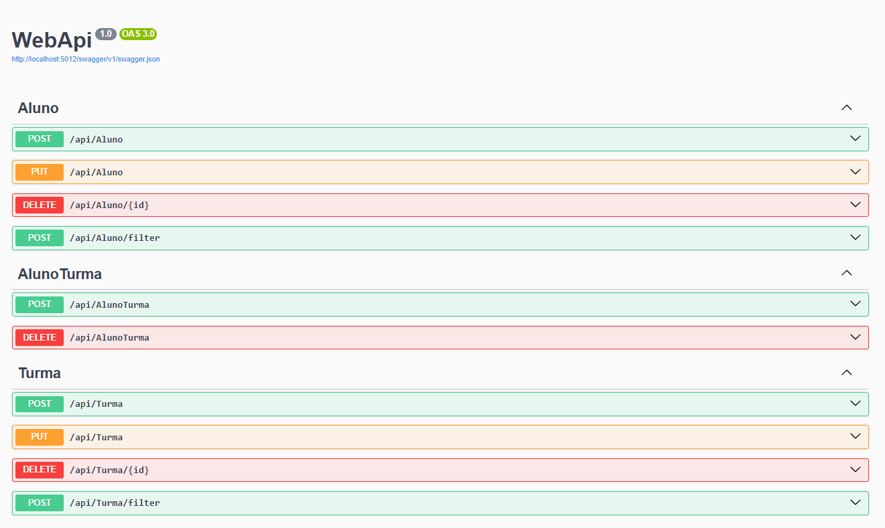

# API de Gerenciamento de Alunos e Turmas

Esta é uma API de estudo, desenvolvida em ASP.NET Core que permite gerenciar alunos, turmas e suas matrículas. Ela fornece endpoints para criar, atualizar, deletar e buscar informações sobre alunos, turmas, e a relação entre ambos.

## Funcionalidades

- **Alunos**: Gerencie os dados dos alunos, incluindo nome, CPF e e-mail.
- **Turmas**: Gerencie informações sobre as turmas, como código, nível e quantidade máxima de alunos.
- **Matrículas (AlunoTurmas)**: Relaciona os alunos com as turmas, permitindo matricular e desmatricular alunos nas turmas.

## Endpoints

### 1. **Aluno**
- `POST /api/aluno`: Cadastra um novo aluno.
- `PUT /api/aluno`: Atualiza os dados de um aluno existente.
- `DELETE /api/aluno/{id}`: Exclui um aluno pelo seu ID.
- `POST /api/aluno/filter`: Retorna uma lista de alunos, com opções de filtragem por ID, nome e e-mail, além de paginação.

### 2. **Turma**
- `POST /api/turma`: Cadastra uma nova turma.
- `PUT /api/turma`: Atualiza os dados de uma turma existente.
- `DELETE /api/turma/{id}`: Exclui uma turma pelo seu ID.
- `POST /api/turma/filter`: Retorna uma lista de turmas.

### 3. **AlunoTurmas**
- `POST /api/alunoTurma`: Matricula um aluno em uma turma.
- `DELETE /api/alunoTurma`: Desmatricula um aluno de uma turma.

